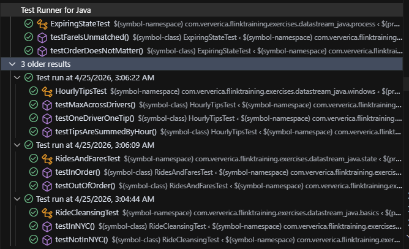

#### Для выполнения работы был склонирован репозиторий https://github.com/ververica/flink-training-exercises

В ходе работы были выполнены задания:

1) [RideCleanisingExercise](./flink-training-exercises/RideCleansingExercise.java)
2) [RidesAndFaresExercise](./flink-training-exercises/RidesAndFaresExercise.java)
3) [HourlyTipsExercise](./flink-training-exercises/HourlyTipsExercise.java)
4) [ExpiringStateExercise](./flink-training-exercises/ExpiringStateExercise.java)

Корректность выполненых заданий было протестировано через юнит тесты. Результаты тестирования приведены ниже.

